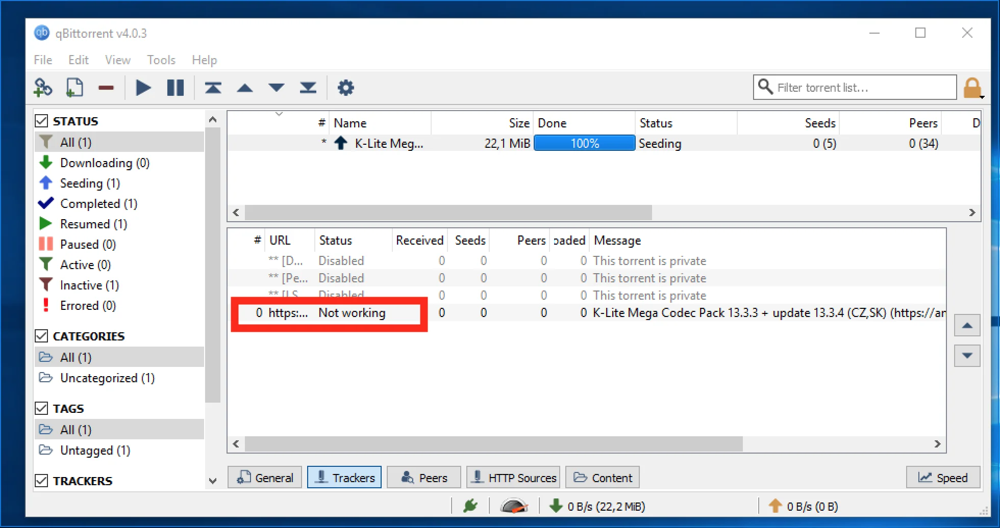

# Torrents

## 1. Installation de qBittorrent

- Téléchargez qBittorrent sur le site officiel : [qBittorrent](https://www.qbittorrent.org/)
- Lancez l'installation et suivez les instructions.

## 2. Configuration du port

- Ouvrez qBittorrent > `Outils` > `Options` > `Connexion`.
- Choisissez un port manuel entre 49160 et 65534.

## 3. Bloquer le port dans le pare-feu Windows

- Ouvrez `Panneau de configuration` > `Système et sécurité` > `Pare-feu Windows Defender` > `Paramètres avancés`.
- Créez une nouvelle règle pour bloquer le port TCP configuré.
- Appliquez la règle à tous les profils (Domaine, Privé, Public).
- Nommez la règle (ex. "Bloquer qBittorrent") et validez.

## 4. Supprimer le tracker YggTorrent d’un torrent

- Dans qBittorrent, faites clic droit sur le torrent > `Propriétés` > onglet `Trackers`.
- Sélectionnez le tracker YggTorrent et supprimez-le.
- Répétez pour chaque torrent YggTorrent pour protéger votre ratio.

## 5. Installer et utiliser Ratio Master

- Téléchargez Ratio Master sur GitHub : [Ratio Master GitHub](https://github.com/NikolayIT/RatioMaster.NET)
- Extrayez et lancez-le.
- Dans Ratio Master, cliquez sur `Browse` dans la section `Torrent File` et sélectionnez un torrent.
- Dans `Speed Options`, définissez la vitesse d'upload à 1000 kB/s.
- Cochez `Random Values` et définissez les valeurs min à 150 et max à 180.
- Définissez la vitesse de téléchargement à 0 et décochez `Random Values`.
- Dans `Options`, définissez `Finished` à 100%.
- Cliquez sur `Start`.
- Surveillez votre ratio et ne dépassez pas 2.
- Ne laissez pas Ratio Master uploader trop longtemps pour éviter la détection.
